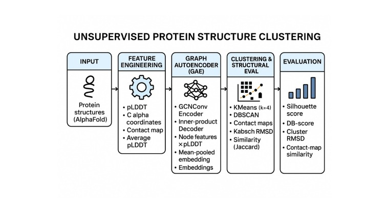
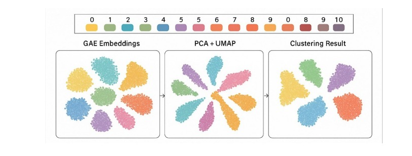
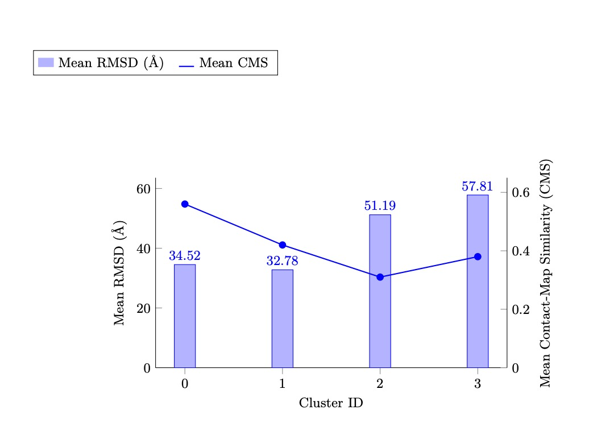

# Graph Autoencoder-Driven Structural Pattern Discovery  
## AlphaFold E. coli Proteome (4,371 Proteins)

Author: Parth Hasolkar,Shivtej Ghorpade,Farhaan Kammar,Yashvant Kate, Dr. Sharada Shiragudikar
KLE Technological University, Hubballi

---

## Problem Statement

AlphaFold has predicted thousands of protein structures.  
Traditional structural alignment methods (TM-align, DALI) are computationally expensive.

This project proposes a scalable, alignment-free framework using:

- Residue-level protein graphs
- Graph Autoencoder (GAE)
- K-Means clustering
- Structural validation using RMSD and Contact Map Similarity

---

## Proposed Framework

Pipeline stages:

1. Parse AlphaFold .cif.gz files
2. Extract Cα coordinates
3. Construct contact maps (8Å threshold)
4. Build residue-level graphs with pLDDT features
5. Train Graph Autoencoder
6. Extract protein-level embeddings
7. Perform K-Means clustering (k = 4)
8. Validate clusters using RMSD & CMS

---

## Final Clustering Results (k = 4)

| Cluster | Proteins | RMSD (Å) | CMS |
|----------|----------|----------|------|
| 0 | 615 | 34.52 | 0.56 |
| 1 | 3702 | 32.78 | 0.42 |
| 2 | 18 | 51.19 | 0.31 |
| 3 | 37 | 57.81 | 0.38 |

Lower RMSD and higher CMS indicate stronger intra-cluster structural coherence.

---

## Embedding Visualization

---

## 📉 Structural Validation

---

## How To Run

### 1. Install dependencies
pip install -r requirements.txt

### 2. Preprocess structures
python src/preprocess.py

### 3. Build graphs
python src/build_graphs.py

### 4. Train Graph Autoencoder
python src/train_gae.py

### 5. Perform clustering
python src/clustering.py

### 6. Evaluate clusters
python src/evaluation.py

---

## 📄 Paper

Full paper available in:
paper/Final Paper.pdf

---

## 📚 Citation

Hasolkar, P., Kammar, F., Ghorpade, S., Kate, Y., & Shiragudikar, S. K.  
Graph Autoencoder-Driven Discovery of Structural Patterns in the AlphaFold E. coli Proteome. 2025.
